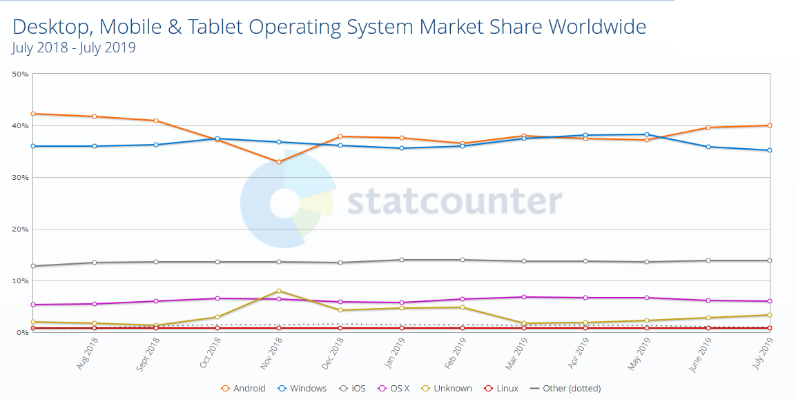
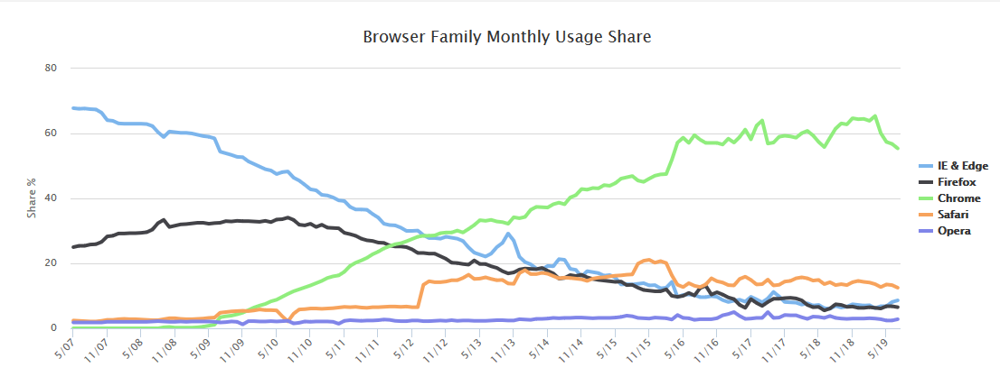

```
WORK IN PROGRESS, jotting ideas.
```


# The Future of Work
Continuing Our Improvements 


[Switch to presentation](https://sara-sabr.github.io/util-presentation/presentation.html?gh-scope=sara-sabr/ITResearch-Prototyping&gh-file=topics/devices/presentation.md)

---

## Agenda

1. The Question
2. Risks and Mitigations
3. Approaches 
4. Summary 

---

## The Question

If there were no budget, staffing, or other constraints, what would the business look like? How will it drive value and provide meaningful work?  
[Deloitte](https://www2.deloitte.com/insights/us/en/focus/technology-and-the-future-of-work/tech-leaders-reimagining-work-workforce-workplace.html?id=us:2el:3lk:4di_gl:5eng:6di&range=4/207/3/1/3/43/84/0:1,4/207/3/1/3/43/84/0:145)

--

### Where is the value add?

--

### The Changes Happening 

#### Worldwide OS

  
[Reference - StatsCounter](https://gs.statcounter.com/os-market-share/desktop-mobile-tablet/worldwide/#monthly-201807-201907)

--

#### Internet Browsers

  
[Reference: W3C Counter](https://www.w3counter.com/trends)


---

## Why different OSes

Linux: https://www.techrepublic.com/article/five-big-names-that-use-linux-on-the-desktop/

---

## Change Google

https://www.w3counter.com/globalstats.php?year=2019&month=7

---

## The challenges

---

## The Approaches

---
